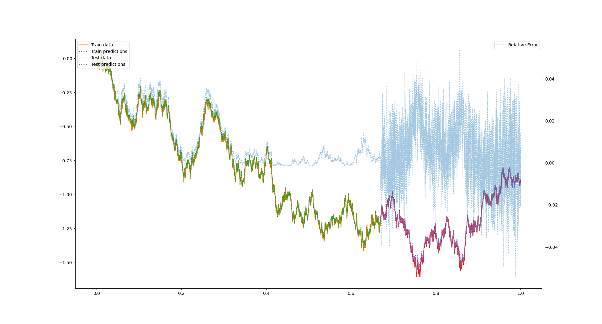

# Timeseries

Fit ML models to generated data.

## Stochastic processes

Currently implemented stochastic processes are the [Brownian motion](https://en.wikipedia.org/wiki/Brownian_motion), [Geometric Brownian motion](https://en.wikipedia.org/wiki/Geometric_Brownian_motion), the [Ornstein-Uhlenbeck process](https://en.wikipedia.org/wiki/Ornstein%E2%80%93Uhlenbeck_process) and [Brownian motion with jump](https://en.wikipedia.org/wiki/Jump_process).

## ML models

`LSTM.py` fits an LSTM to a Brownian motion.
 

